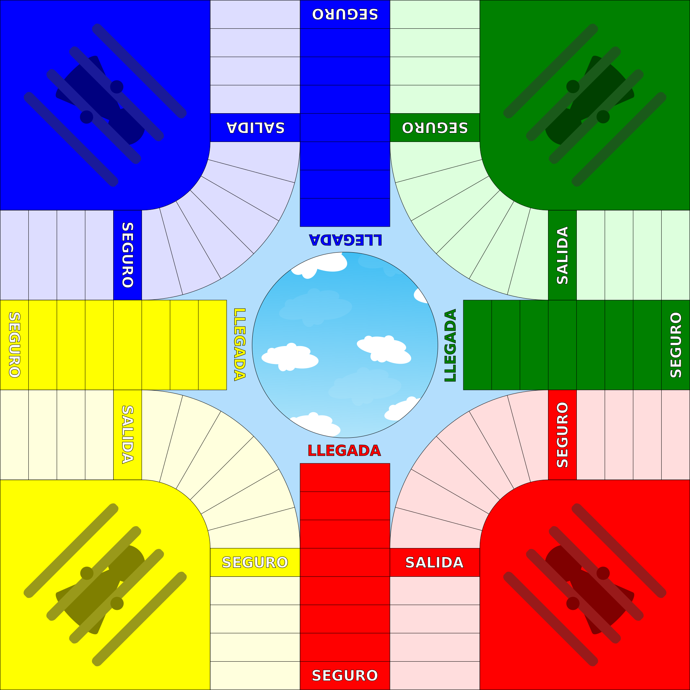

# Parqués

C++ implementation of [Parqués](https://en.wikipedia.org/wiki/Parqu%C3%A9s), a traditional Colombian game from the [Cross and Circle](https://en.wikipedia.org/wiki/Cross_and_circle_game) family (like [Pachisi](https://en.wikipedia.org/wiki/Pachisi), [Parchís](https://en.wikipedia.org/wiki/Parch%C3%ADs) and [Ludo](https://en.wikipedia.org/wiki/Ludo).

This repository contains the game logic implementation needed for making a UI game. This project compiles to a C++ library that can then be embedded in UI games.

I'm making this just for fun, to practice with some of the newest C++ features.

## Game Rules

Traditional Parqués is played with 4 players (although some boards allow up to 8 players).
Each player picks a color, and uses the pieces and side of the board of the chosen color.

At the start, every piece of the player is located at "Home", and as they throw dice, they move around the board until
reaching the final stair (that has their chosen color). After going up the stair they reach the goal position.

Once all pieces of a player have reached the goal, the game ends and that player wins.

Along the way, when a player falls in a spot occupied by other player's pieces, those pieces are "captured" and sent 
back home.

Image Source: [Wikipedia](https://en.wikipedia.org/wiki/File:Tablero_de_parqu%C3%A9s.svg)

## What makes this game interesting to implement?

I wanted to practice my C++ skills (it's been a while), so I thought of given this game a try. 
Even though the rules above seem simple, this game has several other rules that make the implementation interesting:

- The pieces of each player follow a different path depending on their color: even though most of the board is 
  shared, once they reach a certain spot, they take a different direction to go up their respective stairs.
- The board is not square, nor linear, not even circular. The presence of the stairs make the board each player sees 
  to be different from the one other players see.
- Some spots are "safe", which changes the "capture" rules. But one of the safe spots is not that safe if there are 
  pieces at home (if they go out of home, they capture the pieces that were walking by)
- If you can capture another player's piece by moving one of yours, but don't realize and move a different piece,
  any other player can call you out (snitch, "soplar") for losing the opportunity.
  When that happens, the piece that lost the opportunity is sent home.
- Rolling doubles is good as it gives you another chance to throw even more dice, but roll 3 in a row and all your pieces 
  are moved back home.

With some many rules that feel like "exceptions to the rules", and the non-standard board shape, the implementation
looked appealing to me.

## Is there a UI for this game?

I have not yet made a UI for it. I'm planning to do it using either Unity3d (which I already have experience with, so it would be quicker)
or with an engine that allows me to code in C++ ([GoDot](https://godotengine.org/) or [Unreal](https://www.unrealengine.com/)).

As I code this kind of projects after work, it may take a time. Stay tuned!

# Other technologies used

- [Catch2](https://github.com/catchorg/Catch2) for testing
